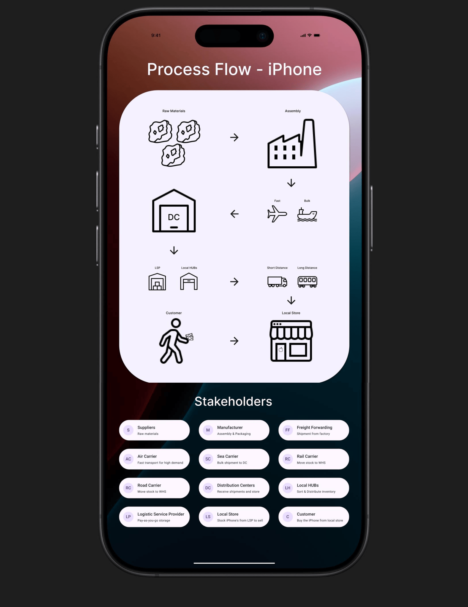

# Supply Chain Process Flow iPhone

This project is a Supply Chain Process Flow of an iPhone designed specifically with an Apple design theme. It was created using Figma.

## Overview

This design visually represents the supply chain process of an iPhone while maintaining an Apple-like UI aesthetic. The goal is to make the flow easy to understand and seamlessly integrate with Apple's design principles.

## View the Design in Figma

You can check out the full design on Figma using the link below:

[Figma Project Link](https://www.figma.com/design/EV5inPrL0MCxeo2bi1OgQd/iPhone-Process-Flow?node-id=0-1&t=sbu22ZhlqgveZUxT-1)

## Tools Used

- Figma for UI/UX design

- iPhone Design Theme (iOS 18 UI kit) for consistency

## How to Use

- Open the Figma link to explore the design.

- Analyze the simplified supply chain process flow.

- Use it as a reference for your projects or improvements.

## Contact
If you have any questions or suggestions, feel free to reach out:

- Email: business@l145.be
- LinkedIn: https://www.linkedin.com/in/aryan-shah-l145
- GitHub: legelff
